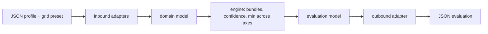

# Architecture

## Stack

- **TypeScript** on Node, `strict` mode with every strict flag plus `noUncheckedIndexedAccess` and `exactOptionalPropertyTypes`. Picked for iteration speed on a solo build with enough type discipline to hold the hexagon; distribution is via Docker, so runtime portability is not a concern.
- **Zod** at every inbound boundary: adapters parse and reject, the core only ever sees validated model objects.
- A `Result` discriminated union carries the unknown / error paths — no exceptions for expected outcomes (a criterion returns "unknown", it never throws).

## How it fits together

## Key decisions

- **Hexagonal, ports & adapters.** The core holds three domain models — profile, grid, evaluation — plus the engine (bundles, confidence, aggregation, `min()` across axes). It depends on no stack, no format, no grid. Only the model crosses the boundary.
- Ports the core owns: profile source, grid source, evaluation sink, criterion-evaluator, evaluator catalogue.
- Adapters, all swappable: `JSON → model` and `model → JSON` first; DB, HTTP, stdio, event queue (RabbitMQ, MQTT), graphical render are later adapters that change no core line.
- **Each criterion is a pluggable evaluator** registered in the catalogue. It declares the profile pieces it needs, returns "unknown" when they are missing, and emits readings tagged by axis (one evaluator may feed several axes). Evaluators wrapping an external tool (Sonar, vulnerability scan) are adapters that shell out and must degrade without network.
- **Calibration lives in the grid preset, never in the evaluator.** Same evaluator + different grid → different verdict. A grid tunes three surfaces: thresholds; the analysis statistic when several are defensible (mean / median / std-dev / quartile); the bundle composition and weights.
- **Axis verdict = confidence-weighted vote** across its bundle — not a product of confidences, which would collapse as criteria are added.
- For the hackathon a grid composes from a **fixed catalogue of coded criteria**. A criterion-definition mini-language and grid-declared new axes are deferred.
- Quality / security / duplication criteria are ordinary plugins. The grid decides whether such a criterion counts toward the level, toward confidence only, or toward a cap; the AIDD reference grid puts code quality out of scope, so an AIDD preset uses them as confidence / cap signals.

## Gotchas

- The AIDD grid is one preset among others — nothing in the core may hardcode its axes or the word "AIDD".
- A missing profile piece is "unknown" (evidence sufficiency ≈ 0), never a negative reading.
- `declaratif` can lower confidence and cap an axis; it can never raise a level.
