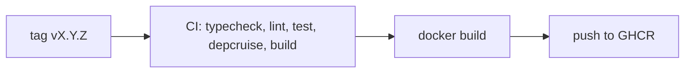

# Deployment

## Pipeline

- **GitHub Actions**.
- CI on push and PR: `typecheck`, `lint`, `test`, `depcruise`, `build` — commands live in `coding-assertions.md` (single source).
- CD on a `vX.Y.Z` tag: CI must pass, then build the Docker image and push it to **GHCR**.

## Environments

- None running yet. A staging deployment is deferred.

## Release

- Cut by pushing an annotated `vX.Y.Z` tag; CD publishes the image. No rollback procedure yet.

## Monitoring

- None yet.
