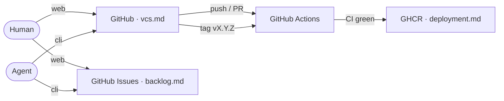

# Ecosystem

```mermaid
flowchart LR
  Human([Human])
  Agent([Agent])
  Vcs["GitHub · vcs.md"]
  Tracker["GitHub Issues · backlog.md"]
  CI["GitHub Actions"]
  Registry["GHCR · deployment.md"]

  Human -- web --> Vcs
  Agent -- cli --> Vcs
  Human -- web --> Tracker
  Agent -- cli --> Tracker
  Vcs -- "push / PR" --> CI
  Vcs -- "tag vX.Y.Z" --> CI
  CI -- "CI green" --> Registry
```
