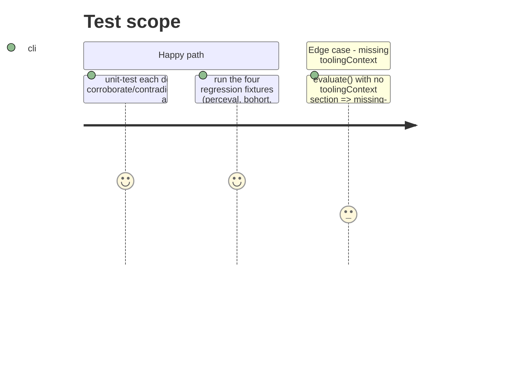

# Instruction: behavior-artifact-density criterion, wiring, calibration

## Architecture projection

```txt
.
├── src/criteria/
│   ├── behavior-artifact-density.ts        ✅ create
│   ├── behavior-artifact-density.test.ts   ✅ create
│   └── index.ts                            ✏️ modify — register + export the new evaluator
└── presets/aidd.json                       ✏️ modify — add the bundle entry on axis `harness`
```

## Test Scope



## Tasks to do

### `1)` Write `src/criteria/behavior-artifact-density.ts`

> A second `harness` criterion, role `confidence`. `needs: ['toolingContext']`.

1. Signal: `density = tc.rulesCount + tc.agentsCount + tc.hooksCount + tc.skillsCount` (skills counted here — `tooling-context-depth`'s own `behaviorArtifacts` gate does not count skills, which is what makes this a genuinely independent read, not a restatement).
2. Params (all overridable via the grid's bundle entry, same names/defaults as `tooling-context-depth` for the three it shares, so a preset can calibrate both from one vocabulary):
   ```ts
   const PARAM_DEFAULTS = {
     rankNothing: 0,
     rankPrompts: 1,
     rankMemory: 2,
     rankBehavior: 4,
     densityStrong: 4,
   } as const;
   ```
3. Rank selection — mirrors `tooling-context-depth`'s own fallback chain for every tier below "behavior", substituting the density cutoff for its presence-only (`behaviorArtifacts >= 1`) gate:
   ```ts
   function tierRank(tc, density, params): number {
     if (density >= params.densityStrong) return params.rankBehavior;
     if (tc.projectMemoryPresent) return params.rankMemory;
     if (tc.declaredAssistantTools.length > 0) return params.rankPrompts;
     return params.rankNothing;
   }
   ```
   Resolve `levelId` via `levelByRank(context.grid, rank) ?? orderedLevels(context.grid)[0]`, exactly like `tooling-context-depth`.
4. Confidence of the reading itself:
   - `singleSource: true` (always — no second family here).
   - `sufficiency: 1` (the section is present whenever this line runs; `evaluate` already returned `err` otherwise).
   - `margin`: distance from `density` to whichever threshold decided the tier, normalized and capped at 1:
     ```ts
     const distance = density >= params.densityStrong
       ? density - params.densityStrong
       : params.densityStrong - density;
     const margin = Math.min(1, 0.5 + distance / (params.densityStrong * 2));
     ```
   - `agreement: 1` (agreement is meaningless for a single-source reading; the engine ignores it when `singleSource` is true — follow `tooling-context-depth`'s own convention of still setting it to `1`).
5. `rawValue`: the numeric `density`.
6. `evidence`: one sentence naming the density and the tier read, e.g. `` `artifact density ${density} (rules ${r}, agents ${a}, hooks ${h}, skills ${s}) => tier ${label}` ``.
7. Missing-piece path identical in shape to `tooling-context-depth`'s: `err(missingPiece(['toolingContext'], 'toolingContext section is empty'))` when `context.profile.toolingContext` is `undefined`.

### `2)` Write `src/criteria/behavior-artifact-density.test.ts`

> Same shape as `tooling-context-depth.test.ts` (`makeProfile`, `makeGrid`, a local `tc()` builder).

1. Density `>= densityStrong` (default 4) reads the behavior tier regardless of `projectMemoryPresent`.
2. Density in `[1, densityStrong - 1]` with `projectMemoryPresent: true` reads the memory tier.
3. Density `0` with `declaredAssistantTools` non-empty and `projectMemoryPresent: false` reads the prompts tier.
4. Density `0` with `declaredAssistantTools` empty and `projectMemoryPresent: false` reads the nothing tier.
5. Grid calibration override (a custom `densityStrong` or a custom rank param) changes the elected `levelId`, same pattern as `tooling-context-depth`'s "honours the grid calibration" test.
6. Missing `toolingContext` section returns `err` with `kind: 'missing-piece'` naming `toolingContext`.
7. `margin` is higher when density sits far from the threshold it crossed than when it sits one unit away from that threshold (a relative assertion, not a magic number).

### `3)` Wire the criterion

1. `src/criteria/index.ts`: import `behaviorArtifactDensity` from `./behavior-artifact-density.js`, add it to `builtInEvaluators`, re-export it — same pattern as `prFeatureSize`.
2. `presets/aidd.json`: append to the `harness` axis's `bundle` array:
   ```json
   {
     "criterionId": "behavior-artifact-density",
     "weight": 1,
     "role": "confidence",
     "params": {
       "rankNothing": 0,
       "rankPrompts": 1,
       "rankMemory": 2,
       "rankBehavior": 4,
       "densityStrong": 4
     }
   }
   ```
   Do not touch the existing `tooling-context-depth` entry (`role: "level"`) or any other axis.

### `4)` Calibrate against the four regression fixtures

> Read-only verification — the fixtures under `test/fixtures/profiles/{perceval,bohort,leodagan,arthur}` already carry the `context_files` counts the issue's table is built from. No fixture edits expected.

1. Run `test/regression/known-profiles.test.ts` and confirm it stays green: the `harness` axis's `levelRank` must be unchanged for all four (this test asserts no wired axis reads *below* the profile's known level; `harness` is not in `EXACT_AXES`, so an unchanged `levelRank` is what "no regression" means here).
2. By hand-computation (record in the phase, not in code): confirm the two readings *agree* (same `levelId`) for all four profiles, per the table in issue #20 — i.e. this phase's calibration should currently produce **zero** contradictions across perceval/bohort/leodagan/arthur. A future profile with thin density (`1..densityStrong-1` total artifacts) while `tooling-context-depth` itself already reads "behavior" (its own presence-only, skills-excluded gate crossed) is the scenario that is expected to disagree — none of the four fixtures land there.

### `5)` Full verification

1. `pnpm typecheck && pnpm lint && pnpm test && pnpm depcruise && pnpm build` — all green.
2. E2E CLI smoke on at least one fixture (e.g. `leodagan`): the `harness` axis keeps its level, and its reported confidence is not degraded by the new criterion (no contradiction expected for any of the four).

## Test acceptance criteria

| Task | Acceptance criteria |
| ---- | -------------------- |
| 1 | `behavior-artifact-density.evaluate()` never returns a `levelId` that changes any axis's elected level (role is `confidence`, wired accordingly in the preset) — verified indirectly via task 4. |
| 2 | `behavior-artifact-density.test.ts` passes and each of the 4 density tiers plus the missing-piece path is covered. |
| 3 | `pnpm build` resolves `behaviorArtifactDensity` from `src/criteria/index.ts`; `presets/aidd.json` validates (no schema/parse failure) with the new bundle entry. |
| 4 | `test/regression/known-profiles.test.ts` stays green; hand-computed density for perceval/bohort/leodagan/arthur matches the issue's table (0, 0, 9, 6) and each reading agrees with `tooling-context-depth`'s elected level (no contradiction). |
| 5 | `pnpm typecheck && pnpm lint && pnpm test && pnpm depcruise && pnpm build` exit 0. |
