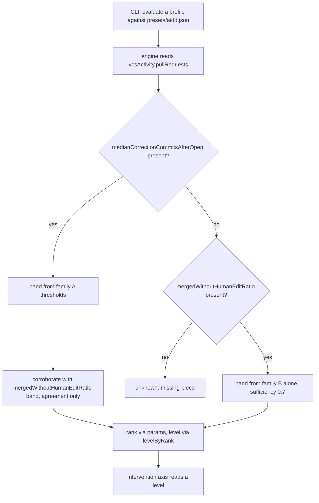
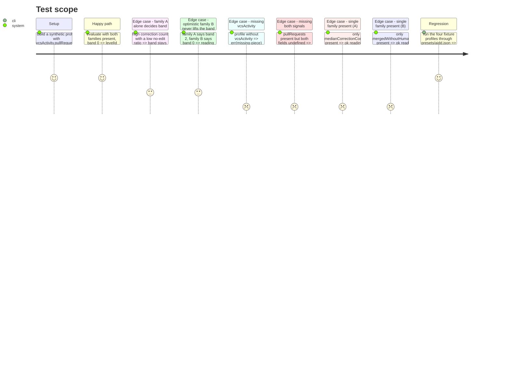

<!-- Fill or omit these sections; never add, rename, or reorder one. -->

# Instruction: pr-correction-load criterion + wiring

## Architecture projection

> Tree of the final files. ✅ create · ✏️ modify · ❌ delete

```txt
.
├── src/criteria/
│   ├── pr-correction-load.ts        ✅ new evaluator, modeled on pr-feature-size.ts
│   ├── pr-correction-load.test.ts   ✅ unit tests: clear reading + missing-piece path
│   └── index.ts                     ✏️ register prCorrectionLoad in builtInEvaluators + export
└── presets/aidd.json                ✏️ fill the `intervention` axis bundle with one entry
```

## User Journey



## Test Scope

<!-- Required for every phase. Keep Setup, Happy path, any qualifying Edge cases, and any required Teardown in this one journey. -->



## Tasks to do

### `1)` Write `pr-correction-load.ts`

> New criterion evaluator for the Intervention axis, same shape as `pr-feature-size.ts`.

1. Declare `PARAM_DEFAULTS`: `correctionsAfterMost=3`, `correctionsAfterSome=2`, `ratioAfterSome=0.15`, `ratioKeyStages=0.40`, `rankAfterMost=1`, `rankAfterSome=2`, `rankKeyStages=4`.
2. `bandFromCorrections(value, p)`: `>= correctionsAfterMost` → band 0; `>= correctionsAfterSome` → band 1; else band 2.
3. `bandFromRatio(value, p)`: `< ratioAfterSome` → band 0; `< ratioKeyStages` → band 1; else band 2.
4. `rankForBand(band, p)`: band 0 → `rankAfterMost`, band 1 → `rankAfterSome`, band 2 → `rankKeyStages`.
5. `evaluate`: read `context.profile.vcsActivity?.pullRequests`; `err(missingPiece(['vcsActivity'], ...))` when absent.
6. Band = family A's band when present (family B never lifts it — corroboration only, per the issue). When family A is absent, family B decides alone at reduced `sufficiency` (the issue's confidence section defines `sufficiency = 0.7` for "only one family present", which is only reachable if a single-family reading is emitted rather than `err`ed); `err(missingPiece(...))` only when both families are `undefined`.
7. `rank = rankForBand(band, p)`; `level = levelByRank(context.grid, rank) ?? orderedLevels(context.grid)[0]`; `err` when the grid declares no levels.
8. Confidence: `singleSource = either family undefined`; `agreement = both families present ? max(0, 1 - 0.4 * |bandA - bandB|) : 1`; `margin` = distance from the deciding family's value to the boundary its band was read against, normalized to `[MIN_MARGIN, 1]` — floored so a reading sitting exactly on an achievable integer boundary is not reported as zero confidence; `sufficiency = both families present ? 1 : 0.7`.
9. `evidence`: one sentence naming both raw values and the reconciled band/level, mirroring `describe()` in `pr-feature-size.ts`.
10. Export `prCorrectionLoad: CriterionEvaluator` with `id: 'pr-correction-load'`, `needs: ['vcsActivity']`.

### `2)` Write `pr-correction-load.test.ts`

> Same structure as `pr-feature-size.test.ts`: a `prProfile()` builder plus one `run()` helper.

1. Reuse `makeProfile`/`makeGrid` from `test/support/factories.js`.
2. One test per calibration row from the issue (perceval/bohort/leodagan/arthur numbers), asserting `rawValue`/`levelId`/`confidence` shape, not the fixture files.
3. Test: optimistic family B does not lift the band (family A band 2, family B band 0 → still band 2, `agreement < 1`).
4. Test: grid-param override changes the resulting `levelId` (mirrors `pr-feature-size`'s "honours the grid calibration" case).
5. Test: `singleSource` true and `sufficiency` 0.7 when only one family is present.
6. Test: `err(missing-piece)` when `vcsActivity` is absent, and when `pullRequests` is present but both signal fields are `undefined`.

### `3)` Wire the criterion

1. In `src/criteria/index.ts`: import `prCorrectionLoad`, add it to `builtInEvaluators`, export it alongside the others.
2. In `presets/aidd.json`: fill the `intervention` axis bundle with one entry — `criterionId: "pr-correction-load"`, `weight: 1`, `role: "level"`, `params` = the seven defaults from task 1 step 1.

### `4)` Verify

1. `pnpm typecheck && pnpm lint && pnpm test && pnpm depcruise && pnpm build` — all green.
2. `pnpm tsx src/cli/main.ts --profile test/fixtures/profiles/<perceval|bohort|leodagan|arthur> --grid presets/aidd.json` for each of the four — Intervention axis reads `red`/`blue`/`>=green`/`copper` respectively.
3. Confirm `test/regression/known-profiles.test.ts` still passes unmodified (no addition to `EXACT_AXES`).

## Test acceptance criteria

<!-- Each criterion is an observable behavior, not a command. -->

| Task | Acceptance criteria                                                                                     |
| ---- | ---------------------------------------------------------------------------------------------------------- |
| 1    | `prCorrectionLoad.evaluate(...)` returns the calibration table's level for each of the four profiles' raw numbers |
| 1    | An absent `vcsActivity`, or a present `pullRequests` with both signal fields `undefined`, returns `err` with `kind: 'missing-piece'` |
| 1    | A high family-B (optimistic) reading never raises the band family A decided; it only affects `agreement` |
| 2    | `pnpm test src/criteria/pr-correction-load.test.ts` passes, covering a clear reading and the missing-piece path per project testing convention |
| 3    | `builtInEvaluators` includes `prCorrectionLoad`; `presets/aidd.json`'s `intervention` axis bundle is no longer empty |
| 4    | `pnpm typecheck && pnpm lint && pnpm test && pnpm depcruise && pnpm build` all exit 0; the CLI run against each of the four fixtures shows the Intervention axis reading matching the calibration table; `known-profiles.test.ts` passes unmodified |
