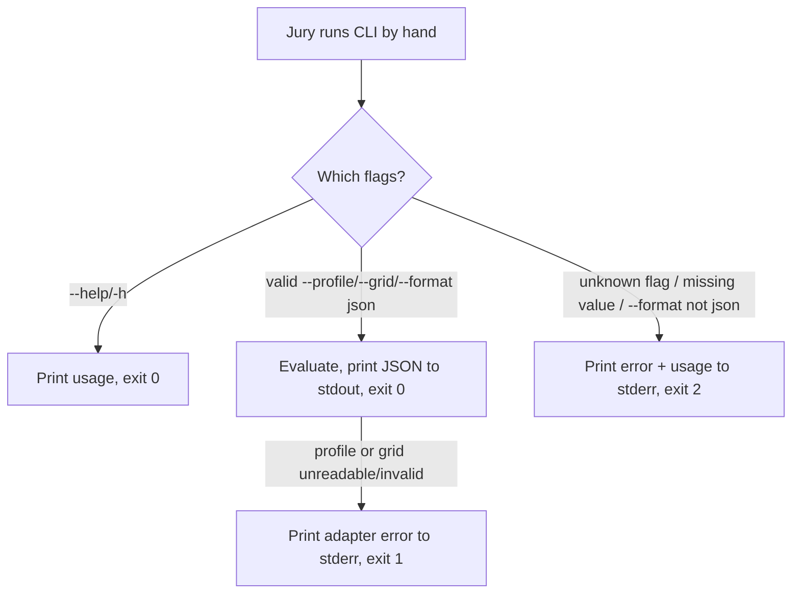
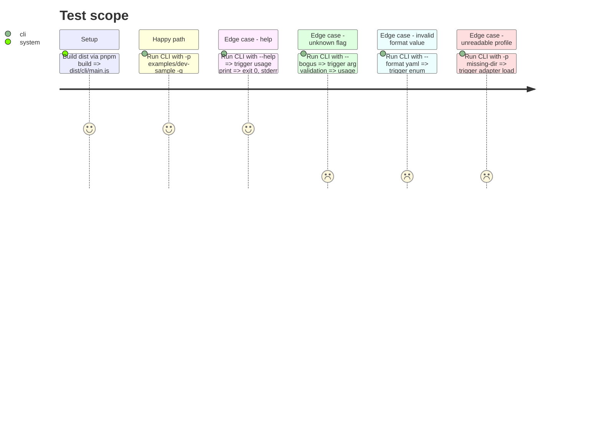

<!-- Fill or omit these sections; never add, rename, or reorder one. -->

# Instruction: --format, --help, exit codes in src/cli/main.ts

## Architecture projection

> Tree of the final files. ✅ create · ✏️ modify · ❌ delete

```txt
src/
└── cli/
    ├── main.ts        ✏️ parseArgs → Result, --format, --help, exit codes 0/1/2
    └── main.test.ts    ✅ unit tests for parseArgs + end-to-end child_process tests
```

## User Journey



## Test Scope



## Tasks to do

### `1)` Turn `parseArgs` into a testable `Result`

> Isolate argument parsing so it is unit-testable without spawning a process.

1. Define `interface Options { readonly profileDir: string | undefined; readonly gridPath: string; readonly minAxes: number | undefined; readonly format: 'json'; readonly help: boolean }` (rename the existing `CliArgs` or fold into `Options`).
2. Change `parseArgs(argv: readonly string[]): Result<Options, string>` (import `Result`, `ok`, `err` from `../core/model/result.js`).
3. Recognize `--help`/`-h` (sets `help: true`, short-circuits remaining validation — no need for `--profile` when help is requested).
4. Recognize `--format <value>`: consume the next token; if missing, `err('missing value for --format')`; if present but not `json`, `err('invalid --format value: <value> (expected: json)')`.
5. Recognize `--profile/-p`, `--grid/-g`, `--min-axes` as today, but return `err('missing value for <flag>')` when the next token is absent instead of silently ignoring.
6. Any other flag (unrecognized `--foo` or `-f`) → `err('unknown flag: <flag>')`.
7. Missing `--profile` (after help short-circuit) → `err('missing required flag: --profile')`.

### `2)` Usage text and exit-code wiring in `main()`

> Route each parse/load outcome to the exit code the issue specifies.

1. Add a `const USAGE = 'usage: laivel-up --profile <dir> [--grid <preset.json>] [--min-axes <n>] [--format json]\n'` (or multi-line listing each flag) shared by the help path and the error path.
2. In `main()`, call `parseArgs`; on `err`, write the error message and `USAGE` to stderr, `process.exit(2)`.
3. On `ok` with `help: true`, write `USAGE` to stdout, `process.exit(0)`, before touching any adapter.
4. Keep `fail()` for adapter load failures (profile/grid), but make it `process.exit(1)` explicitly (it already does) — no behavior change there beyond confirming the code path only fires for load failures, not arg errors.
5. Ensure nothing is written to stdout besides the final JSON when format is `json` (no stray `console.log`/usage on the success path).

### `3)` Tests in `src/cli/main.test.ts`

1. Export `parseArgs` (and `Options`) from `main.ts` for the unit tests (keep `main()` calling `process.exit`, guarded so importing the module for tests doesn't auto-run — follow the existing `if (import.meta.url === ...)`-less pattern already used: check how `main()` is invoked at module bottom today and guard it so the test file can `import { parseArgs } from './main.js'` without side effects; if there is no existing guard convention, add `if (process.argv[1] === fileURLToPath(import.meta.url)) { main(); }`).
2. Unit tests for `parseArgs`: valid full args → `ok`; `--help` alone → `ok` with `help: true`; unknown flag → `err`; `--format yaml` → `err`; missing value for `--grid` → `err`; missing `--profile` → `err`.
3. End-to-end tests via `node:child_process` `spawnSync('node', ['dist/cli/main.js', ...])` (or `tsx` on the `.ts` entry if the existing test suite already runs CLI end-to-end that way — check for a precedent first) against `examples/dev-sample`:
   - `--format json` (with `-p examples/dev-sample -g presets/aidd.json`) → stdout is valid JSON (`JSON.parse` does not throw), exit code 0.
   - `--help` → exit code 0, stdout contains `usage:`.
   - unknown flag → exit code 2.
   - `--format yaml` → exit code 2.

## Test acceptance criteria

<!-- Each criterion is an observable behavior, not a command. -->

| Task | Acceptance criteria              |
| ---- | -------------------------------- |
| 1    | `parseArgs` returns `Result<Options, string>`; every invalid input (unknown flag, missing value, bad `--format`, missing `--profile`) yields `err`, never a thrown exception |
| 2    | `--help`/`-h` exits 0 with usage on stdout and empty stderr; any parse error exits 2 with usage on stderr; adapter load failure still exits 1 |
| 3    | `pnpm test` passes with new unit tests for `parseArgs` and end-to-end tests for `--format json`, `--help`, unknown flag, and `--format yaml`; `pnpm typecheck && pnpm lint && pnpm depcruise && pnpm build` are green |
