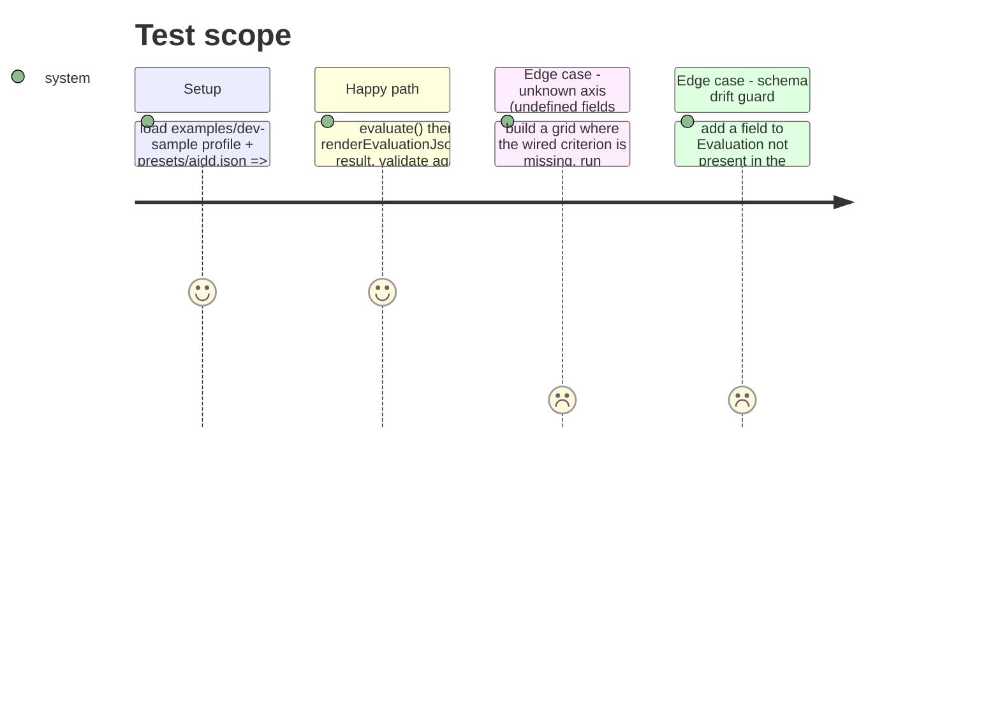

<!-- Fill or omit these sections; never add, rename, or reorder one. -->

# Instruction: Evaluation JSON output schema + conformance test

## Architecture projection

> Tree of the final files. ✅ create · ✏️ modify · ❌ delete

```txt
.
├── docs/
│   └── evaluation.schema.json          ✅ create
├── src/adapters/outbound/
│   └── json-evaluation.test.ts         ✅ create
└── README.md                           ✏️ modify
```

## Test Scope

<!-- Required for every phase. Keep Setup, Happy path, any qualifying Edge cases, and any required Teardown in this one journey. -->



## Tasks to do

### `1)` Write `docs/evaluation.schema.json`

> Draft-07 JSON Schema describing exactly what `renderEvaluationJson` / `JSON.stringify(evaluation, null, 2)` emits for an `Evaluation` (`src/core/model/evaluation.ts`).

1. `$schema: "http://json-schema.org/draft-07/schema#"`, `$id` naming the schema, `type: "object"`.
2. Top level `required`: `subjectId`, `gridId`, `global`, `axes`, `progression`, `generatedAt` — every `Evaluation` field is non-optional in the model, so all are required. `additionalProperties: false`.
3. `global` (`GlobalVerdict`): object, `additionalProperties: false`, `required` = only `confidence` and `note` (the two fields typed without `| undefined`); `levelId` (string), `levelRank` (number), `bindingAxisId` (string) declared in `properties` but **not** in `required` — they are omitted from the JSON when `undefined`, never emitted as `null`.
4. `axes`: array of `AxisVerdict`, `additionalProperties: false` on each item, `required` = `axisId`, `confidence`, `limitingFactor`, `readings`; `levelId` / `levelRank` optional (same reasoning as above).
5. `readings` (`CriterionReading`) inside each axis: `additionalProperties: false`, `required` = `criterionId`, `axisId`, `status` (enum `read`/`unknown`), `role` (enum `level`/`confidence`/`cap`), `confidence`, `limitingFactor`, `evidence`; `levelId`, `levelRank`, `rawValue` optional. `rawValue` type is `["number", "string"]` when present (no `null`).
6. `limitingFactor` everywhere: enum `agreement`, `margin`, `sufficiency`, `none`.
7. `progression` (`ProgressionPlan`): `additionalProperties: false`, `required` = `actions` only; `targetLevelId`, `bindingAxisId` optional strings; `actions` is `array` of `string`.
8. `generatedAt`: `string` (ISO 8601), required.

### `2)` Write `src/adapters/outbound/json-evaluation.test.ts`

> Round-trip a real evaluation through the adapter and validate it against the schema; make the test fail if a model field is unaccounted for.

1. Import `evaluate` (`../../core/engine/evaluate.js`), `inMemoryCatalogue` (`../catalogue/in-memory-catalogue.js`), `builtInEvaluators` (`../../criteria/index.js`), `jsonGridSource` (`../inbound/json-grid.js`), `readProfileFromDirectory` (`../inbound/json-profile.js`), `renderEvaluationJson` from `./json-evaluation.js`.
2. Load `presets/aidd.json` via `jsonGridSource(path).load()` and `examples/dev-sample` via `readProfileFromDirectory(path)` (resolve both paths from `import.meta.url` the same way `src/cli/main.ts` resolves `DEFAULT_GRID`, since vitest's cwd is not guaranteed to be repo root); unwrap both `Result`s with a fail-fast assertion (`expect(result.ok).toBe(true)`) before use.
3. Build the catalogue with `inMemoryCatalogue(builtInEvaluators)`, call `evaluate(profile, grid, catalogue, { now: () => new Date('2026-08-30T00:00:00.000Z') })` for a deterministic `generatedAt`.
4. Serialize with `JSON.parse(renderEvaluationJson(evaluation))` — parsing back mirrors exactly what a consumer of the adapter's stdout/file sink receives (post-`JSON.stringify`, so `undefined` fields are genuinely absent, not present-as-`undefined` in a plain object).
5. Write a small structural validator function (local to the test file or a `test/support/` helper) that walks a JS value against a subset of JSON Schema: `type`, `enum`, `required`, `properties`, `additionalProperties: false`, `items`. No `ajv` import — it is only a transitive dependency, not declared in `package.json` (see plan Decisions). Return a list of violation strings (path + reason), not a throw, for a legible assertion failure.
6. Load `docs/evaluation.schema.json` with `readFileSync` + `JSON.parse`, run the validator against the parsed evaluation, assert the violation list is empty.
7. Second test: reuse the grid from step 2 but with an empty catalogue (`inMemoryCatalogue([])`) so every axis reads unknown; assert the parsed JSON has no `levelId` / `levelRank` / `bindingAxisId` keys at all on `global` (`expect('levelId' in parsedGlobal).toBe(false)`, not `toBeUndefined()`, since the latter also passes for a `null` value) — proving the "absent, not null" contract — and that the same validator still reports zero violations.
8. Third test (drift guard): take the parsed evaluation object from step 4, set an extra unexpected key (e.g. `(parsed as Record<string, unknown>).extraField = 'x'`), run the validator against the schema's top-level `additionalProperties: false`, assert the violation list is non-empty. This is the test the issue requires: "le test échoue si un champ est ajouté à l'Evaluation sans mettre à jour le schéma" — expressed as "the validator catches an unmodeled field," since the test cannot force a real second `Evaluation` field to exist without editing the model.

### `3)` Point to the schema from the README

> One sentence, no new section header.

1. In `README.md`, near the existing description of `--profile` / JSON output (after the "Run it" section's output description), add one sentence: the emitted JSON's shape is documented in `docs/evaluation.schema.json`.

## Test acceptance criteria

<!-- Each criterion is an observable behavior, not a command. -->

| Task | Acceptance criteria              |
| ---- | -------------------------------- |
| 1    | `docs/evaluation.schema.json` is valid JSON, `additionalProperties: false` on every object level, and every `Evaluation` field with `| undefined` in the model is declared but absent from that object's `required` list |
| 2    | `pnpm test src/adapters/outbound/json-evaluation.test.ts` passes: a real `evaluate()` output validates clean; an all-unknown evaluation has no `levelId`/`levelRank`/`bindingAxisId` keys and still validates clean; an evaluation with an injected extra key fails validation |
| 3    | `README.md` contains one sentence pointing to `docs/evaluation.schema.json` |
| all  | `pnpm typecheck && pnpm lint && pnpm test && pnpm depcruise && pnpm build` exit 0 |
