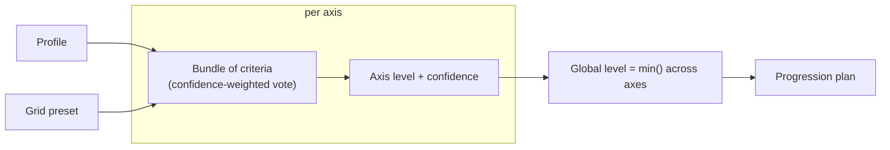

# Concepts

## The idea

Placing a developer on a competency grid from partial evidence is usually a
judgment call — inconsistent, hard to defend. This engine makes it
**reproducible** (same input, same grid, same verdict) and makes it **show
its work**: which axis is holding the subject back, how confident it is,
what would move them up.

The grid is not baked in — it's a **preset**, so the same engine scores
against AIDD today and a different grid tomorrow, no code change. AIDD is
one preset among others.

## Vocabulary

| Term | Meaning |
| --- | --- |
| **Profile** | Everything known about one developer: git activity, pull requests, static analysis, tooling context, a work-session transcript, a self-report — rarely all present. See [Authoring a profile](authoring-a-profile.md). |
| **Grid** (preset) | A config file: ordered levels, axes, which criteria feed each axis and how heavily, thresholds. See [Authoring a grid](authoring-a-grid.md). |
| **Axis** | One dimension of the grid (AIDD: Size, Harness, Intervention, Parallelism). |
| **Level** | An ordered rung, per axis and global. AIDD: White < Red < Blue < Green < Copper < Silver < Gold. |
| **Criterion** | A small closed question on one axis, answered by an **evaluator** — see [Criteria reference](criteria/README.md). |
| **Bundle** | The set of criteria feeding one axis. |
| **Evaluation** | The output: a level per axis, a global level, a confidence trace, a progression plan. |

## How a verdict is built

1. **Parse.** An inbound adapter turns raw input into a `Profile`. A missing
   piece is `unknown`, never a negative reading.
2. **Run each criterion.** Per axis, every criterion in its bundle reads the
   profile and, if it has what it needs, emits a level, a raw value, an
   evidence sentence, and a three-part confidence.
3. **Fold confidence** to the *weakest* of three checks — one weak leg sinks
   the reading, an average would not:
   - **agreement** — do independent signal families point the same way?
   - **margin** — how far from the nearest threshold?
   - **sufficiency** — how much of the bundle actually produced a reading?

   The report names which one is limiting.
4. **Vote per axis** — a **confidence-weighted vote**, not a product of
   confidences (a product collapses toward zero as criteria are added; more
   evidence should never make an axis *less* certain). Two roles bend the
   vote without joining it: **`cap`** only pulls the winner down, never up;
   **`confidence`** never moves the level, only lowers confidence on
   disagreement.
5. **Aggregate.** The global level is the **minimum** across axes that could
   be ruled on. The **binding axis** — the one holding the subject back —
   names itself in the output.
6. **Plan.** The progression plan is the one move that raises the global
   level: close the gap on the binding axis.

## Two rules that shape every criterion

**A self-report can never raise a level.** `declaratif-contradiction` carries
the subject's own self-assessment into every axis, always as `confidence`
role. Disagreement only pulls confidence down — never overrides the
measured level. Facts win.

**Calibration lives in the grid, never in the evaluator.** Every threshold,
weight, and band boundary is a `params` value the grid supplies (an in-code
default lets a criterion work unconfigured). Same evaluator, different
preset, different verdict — see [Authoring a grid](authoring-a-grid.md).

## The regression guardrail

Four real (anonymized, MIT-licensed) sample profiles ship as fixtures —
`perceval` (Red), `bohort` (Blue), `leodagan` (Green), `arthur` (Copper) —
known-good AIDD levels, not a tuning target. `pnpm test` asserts no wired
axis reads *below* the assigned level; Size, fully calibrated, gets an exact
match.

## What never happens

- **No network, no LLM, no API key** in the evaluation path. Every criterion
  is deterministic and degrades to `unknown` rather than guessing.
- **No exceptions for expected outcomes.** A criterion returns a `Result` —
  `ok` or `err(missingPiece)` — it never throws for "I don't have that
  data."
