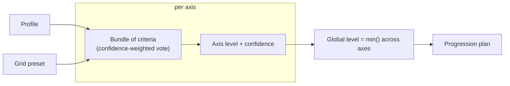

# Concepts

## The idea

Placing a developer on a competency grid from partial evidence is a judgment
call today — inconsistent between reviewers, hard to defend, easy to
sandbag or inflate. This engine makes the call **reproducible**: same input,
same grid, same verdict, every time — and it **shows its work**: which axis
is holding the subject back, how confident it is, and what would move them
up.

The grid itself is not baked in. It is a **preset** — a config file — so the
same engine can score against the AIDD referential today and a game
progression system or an internal review rubric tomorrow, with zero code
change. The AIDD grid ships as one preset among others.

## Vocabulary

| Term | Meaning |
| --- | --- |
| **Profile** | Everything known about one developer: git activity, pull requests, static analysis, tooling context, a work-session transcript, a self-report — rarely all present. See [Authoring a profile](authoring-a-profile.md). |
| **Grid** (preset) | A config file: ordered levels, axes, which criteria feed each axis and how heavily, thresholds. See [Authoring a grid](authoring-a-grid.md). |
| **Axis** | One dimension of the grid (AIDD: Size, Harness, Intervention, Parallelism). |
| **Level** | An ordered rung, per axis and global. AIDD: White < Red < Blue < Green < Copper < Silver < Gold. |
| **Criterion** | A small closed question on one axis, answered by an **evaluator** — see [Criteria reference](criteria/README.md). |
| **Bundle** | The set of criteria feeding one axis. |
| **Evaluation** | The output: a level per axis, a global level, a confidence trace, a progression plan. |

## How a verdict is built

1. **Parse.** An inbound adapter turns raw input into a `Profile` — a portable
   vocabulary of developer-activity facts. A missing piece is `unknown`,
   never a negative reading.
2. **Run each criterion.** Per axis, every criterion in its bundle reads the
   profile and, if it has what it needs, emits: an ordinal level, a raw
   value, an evidence sentence, and a three-part confidence.
3. **Fold confidence.** Confidence is the *weakest* of three checks, never an
   average — one weak leg sinks the whole reading:
   - **agreement** — do independent signal families point the same way?
   - **margin** — how far from the nearest threshold?
   - **sufficiency** — how much of the intended bundle actually produced a
     reading?

   The report always names which one is limiting.
4. **Vote per axis.** The axis verdict is a **confidence-weighted vote**
   across the bundle, not a product of confidences (a product collapses
   toward zero as criteria are added — adding more evidence should never
   make the axis *less* certain). Two roles bend the vote without joining
   it:
   - **`cap`** criteria only ever pull the winner *down* — never up, never
     sideways.
   - **`confidence`** criteria never move the level; they only lower the
     axis's confidence when they *disagree* with the vote.
5. **Aggregate.** The global level is the **minimum** across axes that could
   be ruled on — a level holds only if every axis reaches it. The
   **binding axis** is the one holding the subject back; it names itself in
   the output.
6. **Plan.** The progression plan points at the one concrete move that would
   raise the global level: close the gap on the binding axis.

## Two rules that shape every criterion

**A self-report can never raise a level.** `declaratif-contradiction` carries
the subject's own self-assessment into every axis as a `confidence`-role
reading. When it disagrees with what the evidence elected, it only pulls
confidence down — it never overrides the measured level. Facts win.

**Calibration lives in the grid, never in the evaluator.** A criterion's
code is generic; every threshold, weight, and band boundary is a `params`
value the grid preset supplies (with an in-code default so a criterion works
before it is tuned). The same evaluator, scored against two different
presets, can land two different verdicts — that is the whole point of
presets being swappable.

## The regression guardrail

Four real (anonymized, MIT-licensed) sample profiles ship as fixtures —
`perceval` (Red), `bohort` (Blue), `leodagan` (Green), `arthur` (Copper) —
known-good AIDD levels from the reference material, not a tuning target.
`pnpm test` asserts no wired axis ever reads *below* the assigned level; the
Size axis, fully calibrated, gets the stronger check of an exact match.

## What never happens

- **No network, no LLM, no API key** in the evaluation path. Every criterion
  is deterministic and degrades to `unknown` rather than guessing.
- **No exceptions for expected outcomes.** A criterion returns a `Result` —
  `ok` or `err(missingPiece)` — it never throws for "I don't have that
  data."
