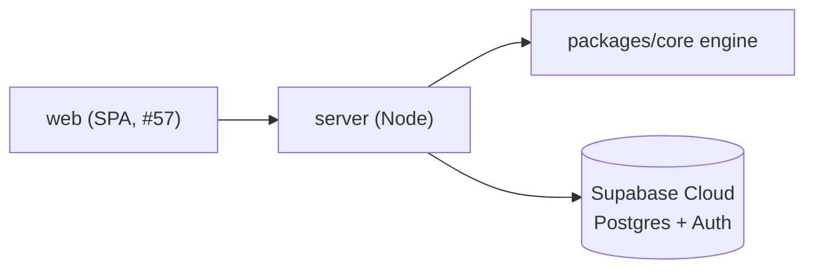

# Grid & profile studio

Part of the [documentation corpus](README.md).

A web app around the evaluation engine. A Lead Tech signs in, builds grids with a
drag-and-drop builder, fills profiles through a form, runs evaluations, and keeps
the history per developer.

The app (backend + web) is self-hosted; the database is a **Supabase Cloud**
project so several leads share it. A local Supabase stack (`supabase start`) is
an option for offline development.

Tracking: epic [#54](https://github.com/Crocogiciel-Studio/laivel-up/issues/54),
phases [#55](https://github.com/Crocogiciel-Studio/laivel-up/issues/55)–[#61](https://github.com/Crocogiciel-Studio/laivel-up/issues/61).

## Boundary

The studio is a **delivery layer**, not a change to the engine. It lives under
`packages/studio-*/` and imports the core one way through `laivel-up/compose` — a subpath
export that wires the engine to the built-in criterion catalogue — exactly like
the CLI does. The hexagon rules still hold: nothing in `packages/core/src/` imports the studio,
and the core gains no dependency. Persistence and HTTP are new adapters.

The offline CLI and the single-file viewer are unaffected.

## Pieces

| Piece | Issue | State |
| --- | --- | --- |
| Schema + RLS, Supabase Cloud | #55 | done |
| Node backend: CRUD + run endpoint | #56 | done |
| Web shell: routing + OAuth login | #57 | done |
| Profile form editor | #58 | done (`packages/studio-web/src/profile/`) |
| Drag-and-drop grid builder | #59 | done (`packages/studio-web/src/grid/`) |
| Run + persisted history + comparison | #60 | done (`packages/studio-web/src/runs/`) |
| Seeded read-only templates | #61 | this change (`packages/studio-db/supabase/migrations/…seed_templates.sql`) |

The web app under `packages/studio-web` — React + Vite + React Router, Supabase OAuth
client-side, all data through the backend — carries the shell (`/login`, an org
switcher, `/org` settings), the profile form (`/profiles`), the grid builder
(`/grids`), and the run screen (`/runs`): pick one grid and **several
profiles** and score them in one batch — each is an independent
`POST /api/runs` and takes its subject identity from the profile body.
The screen is a developer rail plus a focused fiche — the verdict placed on the
grid's level ladder, a per-axis breakdown with the criterion readings behind a
disclosure, the progression plan, and an over-time strip when a developer has
been scored more than once. The evaluation is rendered through `@laivel-up/ui`'s
view-model helpers, resolved against the run's own grid snapshot; a run is
flagged when the grid or profile it used has been edited since.

Each criterion declares its `paramDefaults` (`packages/core/src/core/ports/criterion-evaluator.ts`);
`/api/catalogue` returns them so the builder pre-fills a criterion card. The
builder's output is the `packages/core/presets/*.json` shape — `packages/studio-web/src/grid/preset.test.ts`
round-trips the AIDD preset through it and checks the result still parses via
`laivel-up/compose`.

## Data model

A grid, profile, or run belongs to an **organisation**, not a person. Every
member of the org sees its configs; an **admin or the config's creator** can
change them; **any member can run** an evaluation, and runs are kept as history.
A new user gets a personal org automatically, so solo use just works.

Tables: `org`, `org_member`, `grid`, `profile`, `run` — see
[`packages/studio-db/supabase/README.md`](../packages/studio-db/supabase/README.md). A `run` stores a full copy of the
grid and profile it used, so editing an original never rewrites history.

The known references — the AIDD grid and the four sample profiles
(`perceval`, `bohort`, `leodagan`, `arthur`) — ship as ownerless
`is_template = true` rows in the `20260831170000_seed_templates.sql` migration,
so every user sees them and clones them to edit. The migration is generated from
`packages/core/presets/aidd.json` and `packages/core/test/fixtures/profiles/*` by
`scripts/build-template-seed.mjs` (fixed ids, `ON CONFLICT DO UPDATE`). Edit the
sources and re-run `pnpm db:seed:templates`, never the `.sql`; `pnpm
templates:check` (a CI step) fails if the committed file has drifted. Because
`db push` applies a version once, a later *content* change that must reach an
already-migrated database needs a fresh migration — a local `db reset` restates
it from the regenerated file.

Auth is Supabase Auth (OAuth). Access is enforced by Postgres row-level security
(`is_org_member` / `is_org_admin`); the backend forwards the caller's JWT so the
policies apply to every query. An admin invites people with a link
(`accept_invite()` redeems the token), re-roles or removes members; a member can
leave — the org settings page (`/org`) covers all of it.

## Running

The studio needs a Supabase project behind it — Cloud (shared, what a real
deployment uses) or a local stack (offline, solo, no account). Either way,
sign-in is **OAuth only** (no email/password): the local stack does not fake
a provider, so both paths end with registering a real OAuth app.

### Option A — Supabase Cloud

1. Create a project at [supabase.com](https://supabase.com) (free tier is
   enough).
2. **Authentication → Providers**: enable GitHub or Google, following the
   dashboard's own steps to register the app with that provider.
3. **Authentication → URL Configuration**: add `http://127.0.0.1:5173` to the
   redirect allow-list.
4. **Project Settings → API**: copy the project URL and anon/publishable key.
5. `cp .env.example .env`, fill `SUPABASE_URL` / `SUPABASE_ANON_KEY` and the
   matching `VITE_*` pair with those values.
6. `pnpm db:link` once, then `pnpm db:push` — applies the schema, RLS, and
   seeds the AIDD grid + four sample profiles as read-only templates.
7. `pnpm build && pnpm -C packages/studio-server dev` (backend, `:8787`),
   `pnpm -C packages/studio-web dev` (app, `:5173`).

`docker compose up --build` builds and runs both tiers from the repo-root
`.env` instead of steps 7. For a public URL with no server of your own to run
— [Deploying to Vercel](deploy-vercel.md).

### Option B — a local stack (offline, solo)

1. `pnpm db:start` — spins up Supabase in Docker and applies every migration
   automatically (schema, RLS, the seeded templates). Prints the local API
   URL (`http://127.0.0.1:54321`) and anon key.
2. Register an OAuth app anyway — a GitHub OAuth App is the fastest (free,
   no review): callback URL `http://127.0.0.1:54321/auth/v1/callback`. Flip
   `enabled = true` under `[auth.external.github]` in
   `packages/studio-db/supabase/config.toml`, then restart the stack
   (`pnpm db:stop && pnpm db:start`) so it picks up the change.
3. `cp .env.example .env`, fill `SUPABASE_URL` / `SUPABASE_ANON_KEY` (+
   `VITE_*`) with the local values from step 1, and the
   `SUPABASE_AUTH_EXTERNAL_GITHUB_CLIENT_ID` / `_SECRET` from your OAuth app.
4. `pnpm build && pnpm -C packages/studio-server dev`,
   `pnpm -C packages/studio-web dev`.
5. `pnpm db:stop` when done.

Just verifying the schema + RLS, no UI or OAuth needed: `pnpm db:test`
(against your local stack) or `pnpm db:test:bare` (a throwaway Postgres, no
Supabase images at all — what CI runs).

See [`packages/studio-server/README.md`](../packages/studio-server/README.md) for the routes.
